# Windows Server Active Directory Lab

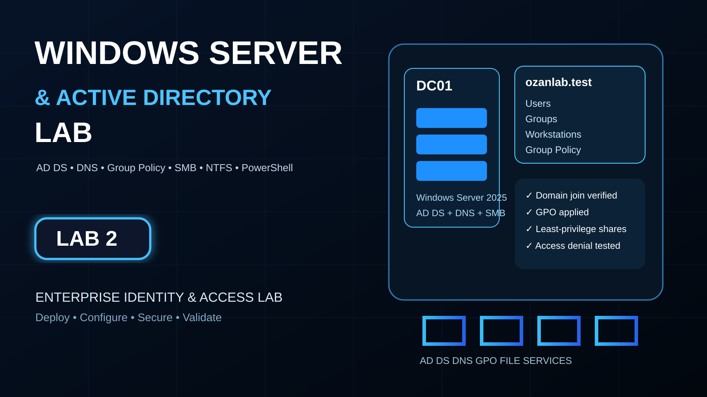

A two-machine enterprise-style identity and access-management lab built in Oracle VirtualBox. The project demonstrates Windows Server administration, Active Directory Domain Services, DNS, Group Policy, domain-client onboarding, and least-privilege departmental file access.

## Project outcomes

- Deployed the `ozanlab.test` forest and domain on Windows Server 2025
- Configured AD-integrated DNS and verified forward name resolution
- Designed an organizational-unit structure for users, groups, workstations, member servers, and service accounts
- Created departmental users and role-based global security groups
- Enforced domain password and account-lockout controls
- Joined a Windows 11 Enterprise workstation to the domain
- Applied a workstation security GPO and verified the effective policy on the client
- Published four SMB shares with matching share and NTFS permissions
- Proved both authorized access and unauthorized access denial
- Diagnosed and corrected a VirtualBox internal-network mismatch

## Architecture

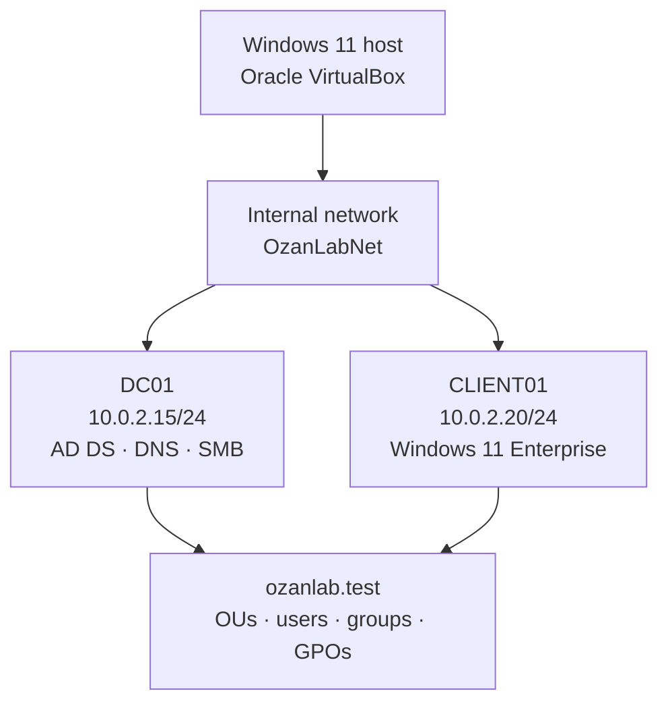

The VMs use an isolated VirtualBox internal network. No default gateway is configured, so the lab cannot route to the host network or Internet.

## Environment

| Component | Configuration |
|---|---|
| Hypervisor | Oracle VirtualBox |
| Domain controller | `DC01` — Windows Server 2025 Standard Evaluation |
| Client | `CLIENT01` — Windows 11 Enterprise Evaluation |
| Domain / NetBIOS | `ozanlab.test` / `OZANLAB` |
| Virtual network | `OzanLabNet` (Internal Network) |
| DC01 network | `10.0.2.15/24`, DNS loopback, no gateway |
| CLIENT01 network | `10.0.2.20/24`, DNS `10.0.2.15`, no gateway |

## Active Directory design

```text
ozanlab.test
└── OzanLab
    ├── Users
    │   ├── IT
    │   ├── HR
    │   ├── Finance
    │   └── Sales
    ├── Groups
    ├── Computers
    │   ├── Workstations
    │   └── Member Servers
    └── Service Accounts
```

| Department | User | Account | Security group |
|---|---|---|---|
| IT | Alex Morgan | `amorgan` | `GG_IT_Users` |
| HR | Maya Chen | `mchen` | `GG_HR_Users` |
| Finance | Daniel Brooks | `dbrooks` | `GG_Finance_Users` |
| Sales | Sofia Ramirez | `sramirez` | `GG_Sales_Users` |

`CLIENT01` was moved from the default Computers container to `OzanLab/Computers/Workstations`, allowing workstation-scoped Group Policy to apply cleanly.

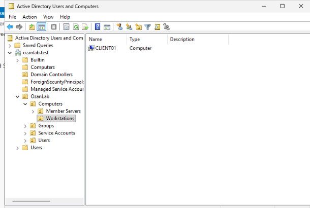

## Security controls

### Domain account policy

| Control | Setting |
|---|---:|
| Minimum password length | 12 characters |
| Password history | 10 passwords |
| Maximum password age | 90 days |
| Complexity | Enabled |
| Lockout threshold | 5 invalid attempts |
| Lockout duration | 15 minutes |
| Counter reset | 15 minutes |

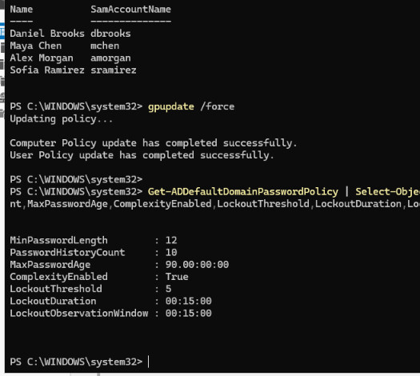

### Workstation Group Policy

The `OzanLab Workstation Security Policy` GPO is linked to the Workstations OU. It sets **Interactive logon: Machine inactivity limit** to `900` seconds, automatically locking inactive workstations after 15 minutes.

The client-side test confirms both the GPO name and the effective registry value.

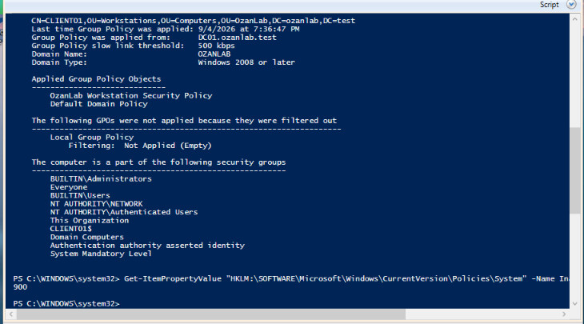

## Domain-client onboarding and validation

`CLIENT01` uses DC01 as its DNS server. Connectivity and name resolution were validated before the domain join.

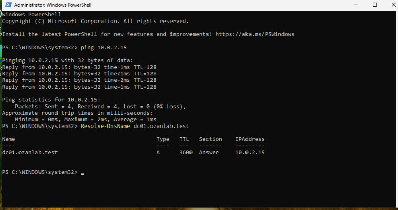

After joining the domain, the secure channel and client identity were verified:

```powershell
whoami
hostname
(Get-CimInstance Win32_ComputerSystem).Domain
Test-ComputerSecureChannel
```

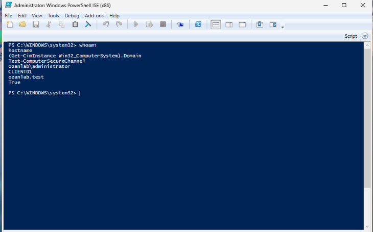

A standard employee sign-in confirmed that `amorgan` received membership in `GG_IT_Users` without local-administrator privileges.

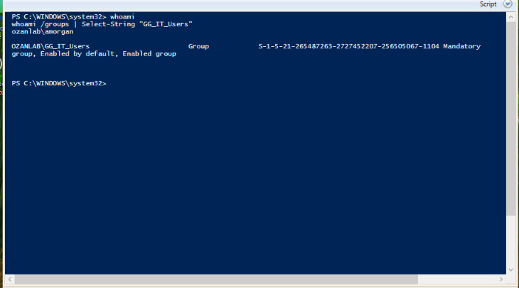

## Departmental file services

| Share | Authorized group | Share permission | NTFS permission |
|---|---|---|---|
| `\\DC01\IT` | `GG_IT_Users` | Change | Modify |
| `\\DC01\HR` | `GG_HR_Users` | Change | Modify |
| `\\DC01\Finance` | `GG_Finance_Users` | Change | Modify |
| `\\DC01\Sales` | `GG_Sales_Users` | Change | Modify |

`Domain Admins` and `SYSTEM` retain Full Control. Department groups receive Modify access only to their matching folder; no access is granted to unrelated departmental groups.

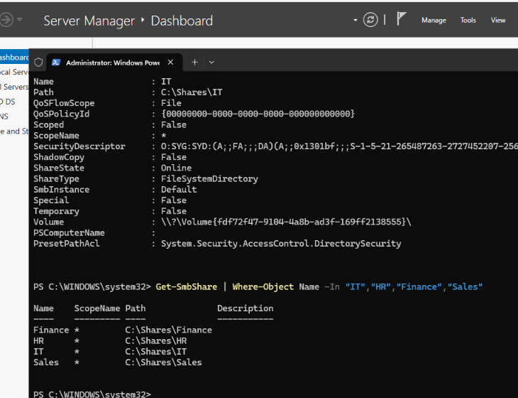

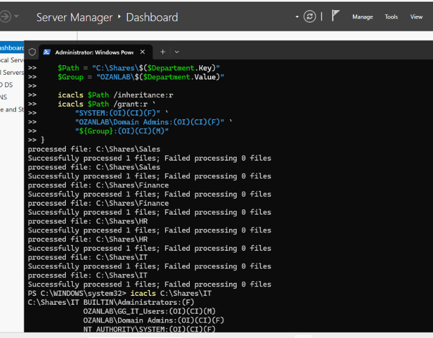

### Positive and negative authorization test

While signed in as `OZANLAB\amorgan`:

```powershell
Set-Content "\\DC01\IT\amorgan-test.txt" "Created by Alex Morgan"
Get-Content "\\DC01\IT\amorgan-test.txt"
Get-ChildItem "\\DC01\HR"
```

The user successfully created and read a file in the IT share. The same user received `Access is denied` against the HR share, proving that the access-control boundary works.

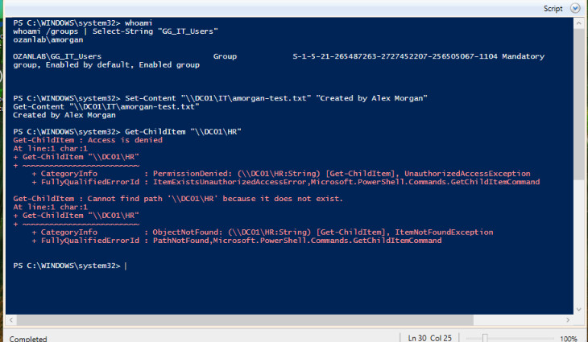

## Troubleshooting highlight

The client initially could not reach DC01 even though both machines had valid static addresses. Testing in both directions returned `Destination host unreachable`, and DNS resolution failed as a downstream symptom.

The root cause was a VirtualBox internal-network mismatch. I shut down both VMs, explicitly selected the same `OzanLabNet` network for Adapter 1 on each machine, confirmed that the virtual cables were connected, then started DC01 before CLIENT01. ICMP and DNS tests succeeded afterward.

DC01 also retained an obsolete NAT default route after the adapter was changed to Internal Network. I removed that route while preserving its static address:

```powershell
Remove-NetRoute -InterfaceAlias "Ethernet" -DestinationPrefix "0.0.0.0/0" -Confirm:$false
```

See [Troubleshooting Notes](docs/troubleshooting.md) for the diagnostic workflow.

## Reproduction and verification scripts

- [`New-DepartmentShares.ps1`](scripts/New-DepartmentShares.ps1) creates the folders and SMB shares and applies matching role-based NTFS permissions.
- [`Test-DomainControllerConfiguration.ps1`](scripts/Test-DomainControllerConfiguration.ps1) reports domain, OU, user, policy, DNS, and share configuration from DC01.
- [`Test-ClientConfiguration.ps1`](scripts/Test-ClientConfiguration.ps1) verifies client addressing, DNS, domain membership, secure channel, applied GPOs, and the inactivity timeout.

Run the scripts from an elevated Windows PowerShell session. Review and adapt domain names, paths, and account names before using them outside this lab.

## Evidence index

1. [Effective domain security policy](screenshots/01-domain-password-lockout-policy.jpg)
2. [DC01 static network configuration](screenshots/02-dc01-static-network-configuration.jpg)
3. [CLIENT01 connectivity and DNS](screenshots/03-client-to-domain-controller-connectivity.jpg)
4. [Domain-join verification](screenshots/04-domain-join-verification.jpg)
5. [CLIENT01 placement in Workstations OU](screenshots/05-client-workstations-ou.jpg)
6. [Workstation GPO verification](screenshots/06-workstation-gpo-verification.jpg)
7. [Domain user group membership](screenshots/07-domain-user-group-membership.jpg)
8. [Departmental SMB shares](screenshots/08-department-smb-shares.jpg)
9. [NTFS permissions](screenshots/09-ntfs-permissions.jpg)
10. [Allowed and denied access test](screenshots/10-allowed-denied-access-test.jpg)
11. [Final recoverable VM snapshots](screenshots/11-final-virtualbox-snapshots.jpg)

## Recovery checkpoints

Final powered-off snapshots preserve the completed environment:

- `dc01-ad-file-services-complete`
- `client01-domain-joined-complete`

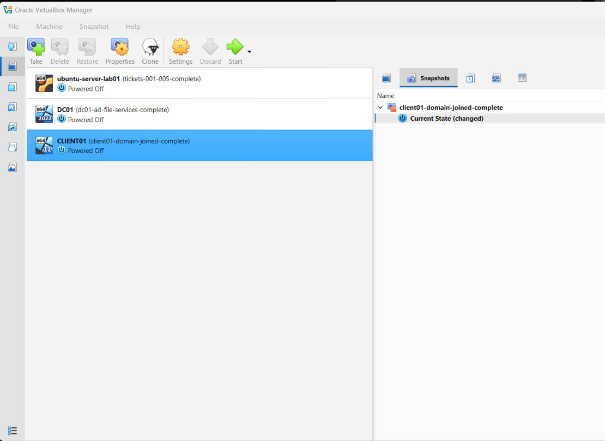

## Skills demonstrated

Windows Server administration · Active Directory Domain Services · DNS · Group Policy · PowerShell · SMB · NTFS permissions · role-based access control · Windows 11 domain onboarding · network troubleshooting · technical documentation

## Notes

This is an isolated educational environment using evaluation software and fictional users. It contains no production systems, credentials, or business data.

