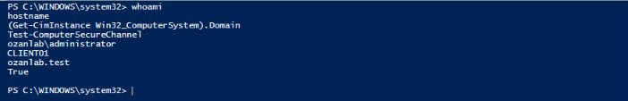
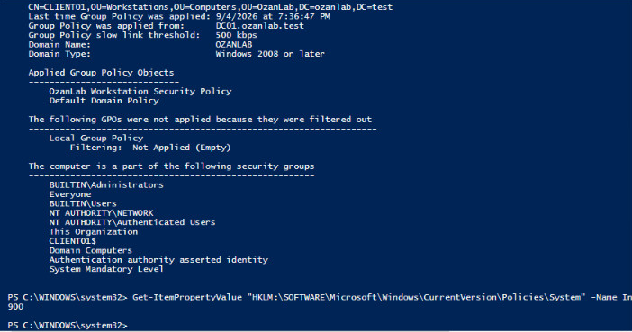
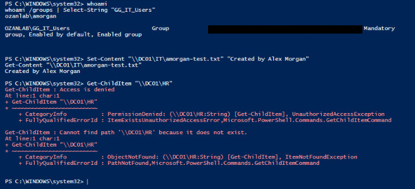

# Evidence highlights

Three focused views from the original lab work, curated on September 25, 2026. These are historical captures, not new test runs or proof of a currently deployed environment.

The images are cropped to the relevant output. Solid black blocks mark redacted identifiers; commands and results have not been rewritten. Local lab names, private addresses and public service endpoints are retained where useful.

## 1. Domain membership and secure channel

CLIENT01 reports ozanlab.test membership and Test-ComputerSecureChannel returns True.

## 2. Workstation Group Policy

The applied GPO list includes OzanLab Workstation Security Policy and the queried inactivity-limit value is 900 seconds.

## 3. Allowed IT access and denied HR access

The IT user creates and reads a file in the IT share; the HR listing returns Access is denied. The subsequent path-not-found message is retained. This tests one account/share boundary.

## Source and integrity notes

Crops were reviewed for readability and sensitive data before publication. Hashes below identify the published crops, not the unedited sources. Existing source captures elsewhere in the repository are retained.

| Published crop | SHA-256 |
| --- | --- |
| `01-domain-membership.png` | `84932279bf87ddbcefbc2284ee879afeda5630c51bbaf9ea2d7b2ed593999b41` |
| `02-workstation-policy.png` | `8b464129f879246988574ceee548987bd5f1b69f8569d1085776526cc519537a` |
| `03-share-access-boundary.png` | `018e8bbd913a24848bb1f37b71fbe0a8327b57e049fe3ec3ca9f494170a2456b` |

[Back to project](../../README.md)
